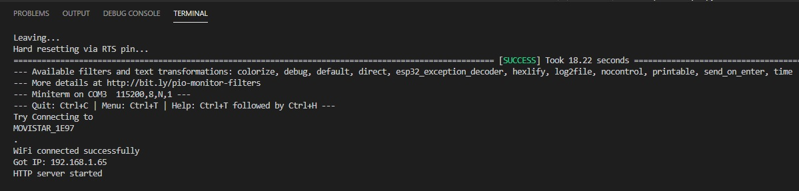

# PRACTICA 3: WIFI Y BLUETOOTH

##INFORME PART A

##### 1.Realizar el informe de funcionamiento asi como la salida por el terminal y la visualización de la conexión a la pagina web con un navegador

El que fem en aquest apartat de la pràctica és generar un servidor web utilizant la nostra placa ESP32. Per aconseguir-ho inicialment s'ha utilitzat el seguent codi:

```
#include <Arduino.h>
#include <WiFi.h>
#include <WebServer.h>

// SSID & Password
const char* ssid = "MOVISTAR_1E97"; 
const char* password = "WcNKxpbmWd7PpF2UtkTq";  

WebServer server(80);  

void handle_root(void);

void setup() {
 Serial.begin(115200);
 Serial.println("Try Connecting to ");
 Serial.println(ssid);

 // Connect to your wi-fi modem
 WiFi.begin(ssid, password);

 // Check wi-fi is connected to wi-fi network
 while (WiFi.status() != WL_CONNECTED) {
 delay(1000);
 Serial.print(".");
 }
 Serial.println("");
 Serial.println("WiFi connected successfully");
 Serial.print("Got IP: ");
 Serial.println(WiFi.localIP());  

 server.on("/", handle_root);

 server.begin();
 Serial.println("HTTP server started");
 delay(100); 
}

void loop() {
 server.handleClient();
}

// HTML & CSS contents which display on web server
String HTML = "<!DOCTYPE html>\
<html>\
<body>\
<h1>My Primera Pagina con ESP32 - Station Mode &#128522;</h1>\
</body>\
</html>";

// Handle root url (/)
void handle_root() {
 server.send(200, "text/html", HTML);
}

```

Primer de tot en l'apartat SSID & Password el que trobem son dos constants amb la SSID del wifi al que ens connectarem i la seva respectiva contrasenya. Seguidament es crea un objecte Web Server que te port HTTP.
En el setup s'inicia el serial i mostra un missatge de "Try connecting to " i la SSID del wifi, aleshores s'intenta connectar al wifi amb la contrasenya que hem proporcionat. Una vegada la connexió s'ha establert amb éxit es mostra el missatge "Wifi connected successfully" i dona una IP local. Despres inicialitza el servidor i mostra un missatge "HTTP server started".
Per últim trobem el codi html que sortira al servidor web.

Aquí podem veure el resultat obtingut en el terminal una vegada realitzada la connexió.

<!--Images-->




##### 2.Modificar la pagina web generando un fichero HTML con el editor Mark down e incluirlo en el codigo . Incluir un fichero adicional que solo incluya la pagina html

En la carpeta de la pràctica podem trobar dos fitxers, "Pagina. md" és el codi realitzat amb Mark down i "Pagina.html" és el codi en format html. Seguidament podem veure el codi resultant amb la nova pagina web (que es el codi actualment al main):

```
#include <Arduino.h>
#include <WiFi.h>
#include <WebServer.h>

// SSID & Password
const char* ssid = "MOVISTAR_1E97";  
const char* password = "WcNKxpbmWd7PpF2UtkTq";  

WebServer server(80);  

void handle_root(void);

void setup() {
 Serial.begin(115200);
 Serial.println("Try Connecting to ");
 Serial.println(ssid);

 // Connect to your wi-fi modem
 WiFi.begin(ssid, password);

 // Check wi-fi is connected to wi-fi network
 while (WiFi.status() != WL_CONNECTED) {
 delay(1000);
 Serial.print(".");
 }
 Serial.println("");
 Serial.println("WiFi connected successfully");
 Serial.print("Got IP: ");
 Serial.println(WiFi.localIP());  

 server.on("/", handle_root);

 server.begin();
 Serial.println("HTTP server started");
 delay(100); 
}

void loop() {
 server.handleClient();
}

// HTML & CSS contents which display on web server
String HTML = "<!DOCTYPE html>\
<html>\
<body>\
<h1>Mimi wo sumaseba</h1>\
<hr>\
<p></p>\
<ul>\
<li><strong>Argument</strong></li>\
</ul>\
<p>La Shizuku és una adolescent aficionada a la lectura, que ha planejat passar les seves vacances d&#39;estiu llegint a la biblioteca i traduint cançons estrangeres. Però, per sorpresa seva, els seus plans fan un gir inesperat quan descobreix que les fitxes dels llibres que agafa de la biblioteca tenen un mateix nom: Seiji Amasawa.</p>\
<p>Un dia, al tren, la Shizuku es troba amb un gat misteriós que la porta a la botiga on en Seiji treballa com a aprenent de lutier. En Seiji explica a la Shizuku que el seu somni és portar el seu art a Itàlia i anima la Shizuku perquè escrigui llibres.</p>\
<ul>\
<li><strong>Fitxa</strong></li>\
</ul>\
<table>\
<thead>\
<tr>\
<th></th>\
<th></th>\
</tr>\
</thead>\
<tbody>\
<tr>\
<td>Direcció</td>\
<td>Yoshifumi Kondō</td>\
</tr>\
<tr>\
<td>Producció</td>\
<td>Toshio Suzuki</td>\
</tr>\
<tr>\
<td>Guió</td>\
<td>Hayao Miyazaki</td>\
</tr>\
<tr>\
<td>Música</td>\
<td>Yuji Nomi</td>\
</tr>\
<tr>\
<td>Fotografia</td>\
<td>Kitaro Kosaka</td>\
</tr>\
<tr>\
<td>Muntatge</td>\
<td>Takeshi Seyama</td>\
</tr>\
<tr>\
<td>Productora</td>\
<td>Studio Ghibli</td>\
</tr>\
</tbody>\
</table>\
<hr>\
<p><em>Paula Muncunill Martinez</em></p>\
</body></html>\
</body>\
</html>";

// Handle root url (/)
void handle_root() {
 server.send(200, "text/html", HTML);
}
```