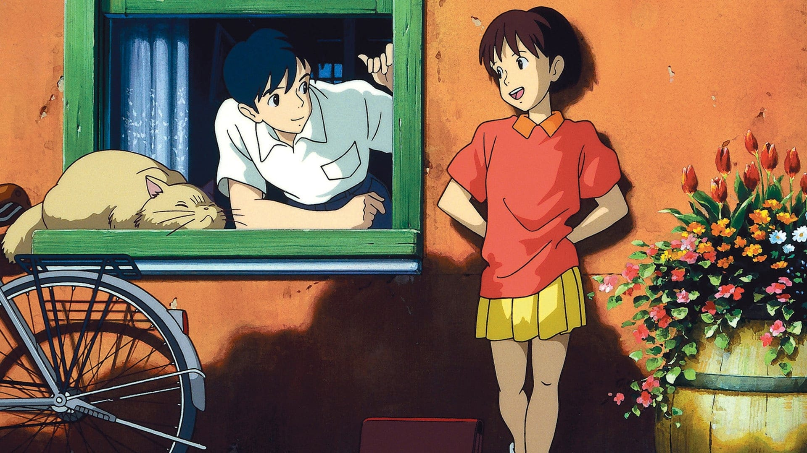

<!--Headers-->
#Mimi wo sumaseba

<!--Horizontal Rule-->

---

<!--Images-->

<!--UL-->
<!--strong-->
* **Argument**

La Shizuku és una adolescent aficionada a la lectura, que ha planejat passar les seves vacances d'estiu llegint a la biblioteca i traduint cançons estrangeres. Però, per sorpresa seva, els seus plans fan un gir inesperat quan descobreix que les fitxes dels llibres que agafa de la biblioteca tenen un mateix nom: Seiji Amasawa.

Un dia, al tren, la Shizuku es troba amb un gat misteriós que la porta a la botiga on en Seiji treballa com a aprenent de lutier. En Seiji explica a la Shizuku que el seu somni és portar el seu art a Itàlia i anima la Shizuku perquè escrigui llibres.

* **Fitxa**

<!--Tables-->
| |  | 
|-------- | -------- | 
|Direcció  | Yoshifumi Kondō  | 
|Producció | Toshio Suzuki  | 
|Guió  | Hayao Miyazaki  | 
|Música  | Yuji Nomi  | 
|Fotografia | Kitaro Kosaka  | 
|Muntatge  | Takeshi Seyama | 
|Productora  | Studio Ghibli  | 

---

<!--Italics-->
*Paula Muncunill Martinez*