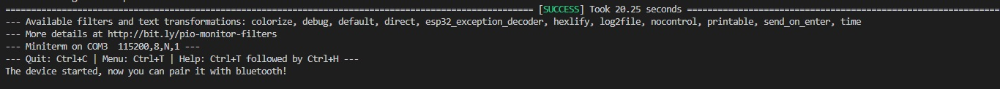

# PRACTICA 3: WIFI Y BLUETOOTH

##INFORME PART B

####codigo
```
#include <Arduino.h>

//This example code is in the Public Domain (or CC0 licensed, at your option.)
//By Evandro Copercini - 2018
//
//This example creates a bridge between Serial and Classical Bluetooth (SPP)
//and also demonstrate that SerialBT have the same functionalities of a normal Serial

#include "BluetoothSerial.h"

#if !defined(CONFIG_BT_ENABLED) || !defined(CONFIG_BLUEDROID_ENABLED)
#error Bluetooth is not enabled! Please run `make menuconfig` to and enable it
#endif

BluetoothSerial SerialBT;

void setup() {
  Serial.begin(115200);
  SerialBT.begin("ESP32test"); //Bluetooth device name
  Serial.println("The device started, now you can pair it with bluetooth!");
}

void loop() {
  if (Serial.available()) {
    SerialBT.write(Serial.read());
  }
  if (SerialBT.available()) {
    Serial.write(SerialBT.read());
  }
  delay(20);
}
```

#####Realizar el informe de funcionamiento asi como las salidas que se obtienen a través de la impresión serie

El que esta fent el codi d'aquesta pràctica és establir una comunicació entre dos aparells.
En el codi primer de tot s'inicia el bluetooth serial, gràcies a la llibreria BluetoothSerial.h.
S'inicia la comunicació serial en el setup amb un missatge de confirmació que informa si l'aparell està en marxa "The device started, now you can pair it with bluetooth!". 
Seguidament tenim l'exemple del terminal en el meu ordinador.

<!--Images-->


Seguidament en el codi trobem un bucle, el que fa es, si esta rebent (llegint) correctament la informació, envia aquesta via bluetooth a l'aparell connectat, aquesta comunicació és establida de manera bidireccional, per tant es segueix el mateix procediment per enviar informació del terminal de visualstudio al de l'aplicació mobil, i per enviar informació de l'apliciació mobil al terminal.


Una vegada està en marxa conectem el nostre telefon a la placa per bluetooth quan s'estableixi la connexió entre els dos aparells si escribim "Hola" a l'aplicació en el nostre mobil podem comprovar que es mostrara el missatge "Hola" en el terminal de visual studio, i el mateix al inreves, si enviem un missatge des del terminal de visual studio, aquest es rebrà al terminal de l'aplicació mobil.
